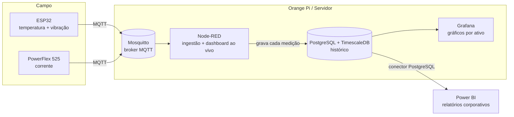

# Visualização, histórico e integração com Power BI

Este documento responde a uma pergunta central do projeto:

> Para ver os gráficos de **vibração, temperatura e corrente** com variação ao
> longo do tempo — e levar isso para o **Power BI** — eu preciso de uma página
> que leia o MQTT, ou de um servidor?

**Resposta: de um servidor.** Uma página que lê MQTT só mostra o valor *ao
vivo*. Gráfico histórico e Power BI exigem **gravar os dados num banco**.

## O conceito que muda tudo: MQTT é transporte, não armazenamento

MQTT entrega a mensagem em tempo real e **não guarda histórico**. Logo:

| Você quer...                                   | MQTT sozinho basta? | Precisa de...                  |
|------------------------------------------------|:-------------------:|--------------------------------|
| Valor ao vivo (número piscando agora)          | Sim                 | Página MQTT/WebSocket ou Node-RED |
| Gráfico das últimas 24 h / 30 dias             | **Não**             | Banco de dados + dashboard     |
| Relatório no Power BI                           | **Não**             | Banco de dados (Power BI ≠ MQTT) |

O Power BI **não conecta em MQTT**. Ele lê de banco de dados, arquivo ou API.

## Arquitetura recomendada

### Os três níveis de visualização

1. **Ao vivo** — dashboard do Node-RED (já existe): cards de status, KPIs na
   Visão Geral, detalhe com tendência/sparkline e uma página de **Alarmes**
   com histórico em memória.
2. **Histórico / engenharia** — **Grafana** lendo o banco: gráficos com
   variação temporal, zoom, comparação entre ativos, alertas.
3. **Corporativo** — **Power BI** lendo o mesmo banco: relatórios e KPIs.

### Por que PostgreSQL + TimescaleDB

É um **único banco** que atende tudo: o TimescaleDB é uma extensão do
PostgreSQL otimizada para série temporal (bom para o Grafana e para a IA
futura), e o PostgreSQL tem **conector nativo no Power BI**. Evita rodar dois
bancos diferentes.

> Alternativa comum: **InfluxDB + Grafana**. Excelente para série temporal,
> mas o Power BI não tem conector nativo de InfluxDB — exigiria uma ponte.
> Por isso, com Power BI no radar, PostgreSQL/Timescale é mais direto.

## Modelo de dados

O esquema completo está em [`sql/01-esquema.sql`](../sql/01-esquema.sql) e é
aplicado pelo `setup_orangepi.sh`. Três tabelas:

| Tabela | O que guarda |
|---|---|
| `ativos` | cadastro — device_id, ativo, parte, TAG do inversor, corrente nominal |
| `medicoes` | série temporal **agregada por minuto**, com média, mínimo e máximo |
| `eventos` | transições de estado, com início, fim e motivo |

### Por que agregada, e não crua

O campo publica a cada 2 s. Com 8 dispositivos são **345 mil linhas por
dia**, 126 milhões por ano — gravadas no eMMC de um Orange Pi, que tem
ciclos de escrita contados. E ninguém consulta resolução de 2 segundos em
cima de meses: consulta tendência.

Uma linha por dispositivo por minuto corta o volume por 30 sem perder nada
da tendência.

**Mas guardamos mínimo e máximo junto da média, e isso não é detalhe.** A
média de um minuto **esconde o pico de vibração** — que é exatamente o que
se está procurando. Média diz como estava; máximo diz o que aconteceu.

O campo `amostras` permite reponderar as médias ao reagregar depois: média
de médias só é correta quando todas têm o mesmo *n*.

### Por que eventos em tabela separada

Um evento não é uma amostra: tem início, fim e duração, e responde a outra
pergunta (*"quantas paradas neste mês?"*) do que a série (*"qual a
tendência?"*). Numa tabela só, achar algumas dezenas de eventos exigiria
varrer milhões de linhas de medição.

### Ativo e parte gravados junto da medição

A `medicoes` guarda `device_id` (a identidade do hardware) **e também** o
ativo e a parte a que ele pertencia naquele momento.

Parece redundante com a tabela `ativos`, mas não é: se amanhã o sensor for
remanejado para outro motor, a história antiga continua contando a verdade
do que era então. A `vw_medicoes` faz o join com o cadastro **atual** para
quem quiser a visão de agora — as duas leituras ficam disponíveis.

### Retenção e agregado contínuo

- Compressão depois de 7 dias, descarte depois de 180.
- `medicoes_hora` é um *continuous aggregate*: o TimescaleDB o mantém
  atualizado sozinho, e uma consulta de um ano lê milhares de linhas em vez
  de milhões. É o que o Grafana e o Power BI devem consultar para janelas
  longas.

Note que ele faz `max(vibracao_max_g)` — o **máximo do máximo**, não o
máximo da média. Reagregar preservando o pico é o motivo de ter guardado
mínimo e máximo.

## Como o Node-RED grava no banco

Já está no fluxo. Um acumulador na ingestão junta as leituras por
dispositivo; a cada 60 s a função **montar insercao** fecha a janela, monta
um `INSERT` em lote (uma ida ao banco por janela, não uma por dispositivo)
e grava. Os eventos são inseridos ao abrir e fechados por `UPDATE` quando
normalizam.

Para mudar a janela, edite o intervalo do nó **gravar (60s)**.

> ⚠️ **Não testado contra um banco real.** O SQL gerado foi conferido —
> contagem de colunas, alinhamento dos `$n`, tipos dos parâmetros — mas
> nenhuma linha chegou a um PostgreSQL de verdade. A primeira execução no
> Orange Pi é que confirma. Se algo falhar, o log do Node-RED mostra o erro
> do Postgres na íntegra.

## Como o Power BI conecta

O Power BI **não lê MQTT** — lê o PostgreSQL:

`Obter Dados → Banco de Dados PostgreSQL → servidor/porta → escolha a view
vw_medicoes`.

Dois modos:

| Modo             | Como funciona                              | Quando usar                    |
|------------------|--------------------------------------------|--------------------------------|
| **Import**       | Copia os dados; atualização agendada       | Relatórios (atualiza a cada X min) |
| **DirectQuery**  | Consulta o banco ao abrir o relatório      | Dados mais "atuais"            |

Para o Power BI Service (nuvem) acessar um PostgreSQL **on-premises** (no Orange
Pi/servidor local), instale o **On-premises Data Gateway**. Para *quase* tempo
real corporativo, há ainda o **streaming dataset** (o Node-RED empurra via API
REST do Power BI) — mas para tendência histórica, o caminho do banco é o certo.

## O que roda onde

Para começar, **tudo pode rodar no próprio Orange Pi**:

- Mosquitto (broker MQTT)
- Node-RED (ingestão + dashboard ao vivo + gravação no banco)
- PostgreSQL + TimescaleDB (histórico)
- Grafana (gráficos por ativo)
- Power BI conecta de fora, no PostgreSQL

**Escala:** o Orange Pi dá conta de alguns ativos. Conforme a planta cresce,
mova o PostgreSQL e o Grafana para um servidor/VM (ou nuvem), mantendo o
Node-RED e o broker na borda. A arquitetura não muda — só o "onde".

## Respondendo a pergunta, em uma linha

Você precisa de um **servidor** (que no começo é o próprio Orange Pi) rodando
**banco de dados + dashboard**. A "página que lê MQTT" serve só para o **ao
vivo**; **histórico e Power BI vêm do banco**.
