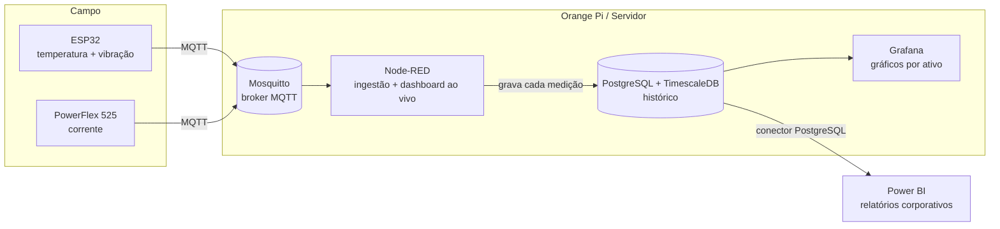

# Visualização, histórico e integração com Power BI

Este documento responde a uma pergunta central do projeto:

> Para ver os gráficos de **vibração, temperatura e corrente** com variação ao
> longo do tempo — e levar isso para o **Power BI** — eu preciso de uma página
> que leia o MQTT, ou de um servidor?

**Resposta: de um servidor.** Uma página que lê MQTT só mostra o valor *ao
vivo*. Gráfico histórico e Power BI exigem **gravar os dados num banco**.

## O conceito que muda tudo: MQTT é transporte, não armazenamento

MQTT entrega a mensagem em tempo real e **não guarda histórico**. Logo:

| Você quer...                                   | MQTT sozinho basta? | Precisa de...                  |
|------------------------------------------------|:-------------------:|--------------------------------|
| Valor ao vivo (número piscando agora)          | Sim                 | Página MQTT/WebSocket ou Node-RED |
| Gráfico das últimas 24 h / 30 dias             | **Não**             | Banco de dados + dashboard     |
| Relatório no Power BI                           | **Não**             | Banco de dados (Power BI ≠ MQTT) |

O Power BI **não conecta em MQTT**. Ele lê de banco de dados, arquivo ou API.

## Arquitetura recomendada



### Os três níveis de visualização

1. **Ao vivo** — dashboard do Node-RED (já existe): gauges e valor instantâneo.
2. **Histórico / engenharia** — **Grafana** lendo o banco: gráficos com
   variação temporal, zoom, comparação entre ativos, alertas.
3. **Corporativo** — **Power BI** lendo o mesmo banco: relatórios e KPIs.

### Por que PostgreSQL + TimescaleDB

É um **único banco** que atende tudo: o TimescaleDB é uma extensão do
PostgreSQL otimizada para série temporal (bom para o Grafana e para a IA
futura), e o PostgreSQL tem **conector nativo no Power BI**. Evita rodar dois
bancos diferentes.

> Alternativa comum: **InfluxDB + Grafana**. Excelente para série temporal,
> mas o Power BI não tem conector nativo de InfluxDB — exigiria uma ponte.
> Por isso, com Power BI no radar, PostgreSQL/Timescale é mais direto.

## Modelo de dados

Duas tabelas: o **cadastro de ativos** (associa hardware ↔ TAG ↔ descrição) e a
**série temporal** de medições.

```sql
-- Cadastro de ativos: associa o hardware à TAG do inversor e à descrição.
CREATE TABLE ativos (
  device_id     TEXT PRIMARY KEY,   -- id estável do ESP32 (ex.: esp-a1b2c3)
  tag_inversor  TEXT NOT NULL,      -- ex.: U1M1
  descricao     TEXT,               -- ex.: Motor Transporte Linear 1
  area          TEXT,               -- ex.: Transporte
  ativo         BOOLEAN DEFAULT TRUE
);

-- Série temporal das medições.
CREATE TABLE medicoes (
  ts            TIMESTAMPTZ NOT NULL DEFAULT now(),
  device_id     TEXT NOT NULL,
  temperatura_c DOUBLE PRECISION,
  vibracao_rms  DOUBLE PRECISION,
  corrente_a    DOUBLE PRECISION
);
SELECT create_hypertable('medicoes', 'ts');       -- TimescaleDB
CREATE INDEX ON medicoes (device_id, ts DESC);

-- View pronta para o Grafana e o Power BI (já traz a TAG e a descrição).
CREATE VIEW vw_medicoes AS
SELECT m.ts, a.tag_inversor, a.descricao, a.area,
       m.temperatura_c, m.vibracao_rms, m.corrente_a
FROM medicoes m
JOIN ativos a USING (device_id);
```

### Por que a TAG fica no cadastro, e não no ESP32

O ESP32 carrega apenas um **`device_id` estável** (identidade do hardware). A
associação com a **TAG do inversor** ("U1M1") e a descrição ("Motor Transporte
Linear 1") vive na tabela `ativos`. Assim:

- trocar um ESP32 queimado = atualizar **uma linha** no cadastro; o histórico
  continua ligado ao ativo;
- a TAG certa aparece no Grafana e no Power BI sem regravar firmware;
- renomear/realocar o equipamento não mexe no campo.

Consulta típica de um ativo (a base de qualquer gráfico):

```sql
SELECT ts, temperatura_c, vibracao_rms, corrente_a
FROM vw_medicoes
WHERE tag_inversor = 'U1M1'
  AND ts > now() - interval '24 hours'
ORDER BY ts;
```

## Como o Node-RED grava no banco

Instale `node-red-contrib-postgresql`. Depois do parse da telemetria, um nó de
função monta a linha e um nó PostgreSQL faz o `INSERT`:

```javascript
// função "monta insert"
const p = msg.payload || {};
msg.query = `INSERT INTO medicoes (device_id, temperatura_c, vibracao_rms, corrente_a)
             VALUES ($1, $2, $3, $4)`;
msg.params = [
  p.device_id,
  p.temperatura_c ?? null,
  p.vibracao?.rms_g ?? null,
  p.corrente_a ?? null
];
return msg;
```

> Corrente e telemetria chegam em tópicos MQTT diferentes. Para gravar numa só
> linha, junte-as antes (guardando a última corrente por ativo em contexto de
> fluxo) **ou** grave em colunas separadas — as duas abordagens funcionam.

## Como o Power BI conecta

O Power BI **não lê MQTT** — lê o PostgreSQL:

`Obter Dados → Banco de Dados PostgreSQL → servidor/porta → escolha a view
vw_medicoes`.

Dois modos:

| Modo             | Como funciona                              | Quando usar                    |
|------------------|--------------------------------------------|--------------------------------|
| **Import**       | Copia os dados; atualização agendada       | Relatórios (atualiza a cada X min) |
| **DirectQuery**  | Consulta o banco ao abrir o relatório      | Dados mais "atuais"            |

Para o Power BI Service (nuvem) acessar um PostgreSQL **on-premises** (no Orange
Pi/servidor local), instale o **On-premises Data Gateway**. Para *quase* tempo
real corporativo, há ainda o **streaming dataset** (o Node-RED empurra via API
REST do Power BI) — mas para tendência histórica, o caminho do banco é o certo.

## O que roda onde

Para começar, **tudo pode rodar no próprio Orange Pi**:

- Mosquitto (broker MQTT)
- Node-RED (ingestão + dashboard ao vivo + gravação no banco)
- PostgreSQL + TimescaleDB (histórico)
- Grafana (gráficos por ativo)
- Power BI conecta de fora, no PostgreSQL

**Escala:** o Orange Pi dá conta de alguns ativos. Conforme a planta cresce,
mova o PostgreSQL e o Grafana para um servidor/VM (ou nuvem), mantendo o
Node-RED e o broker na borda. A arquitetura não muda — só o "onde".

## Respondendo a pergunta, em uma linha

Você precisa de um **servidor** (que no começo é o próprio Orange Pi) rodando
**banco de dados + dashboard**. A "página que lê MQTT" serve só para o **ao
vivo**; **histórico e Power BI vêm do banco**.
