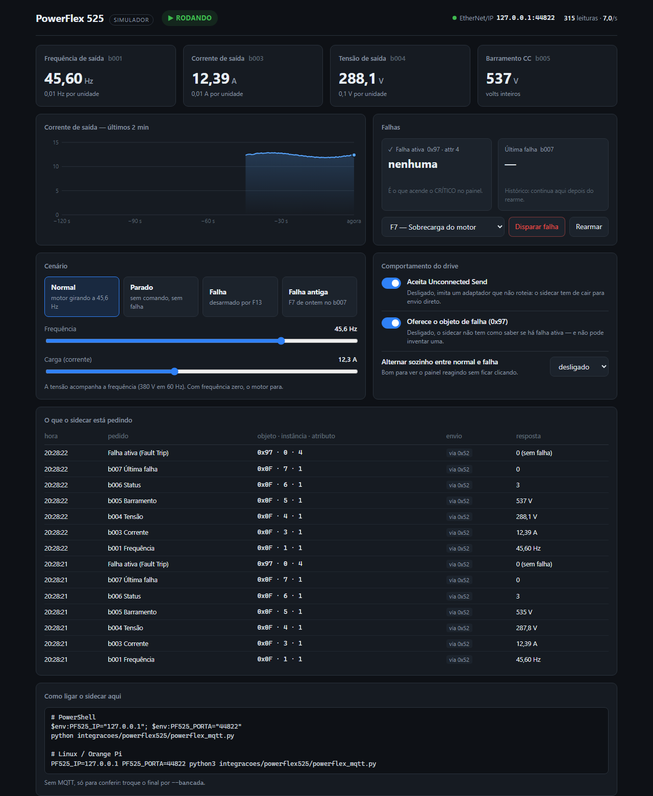
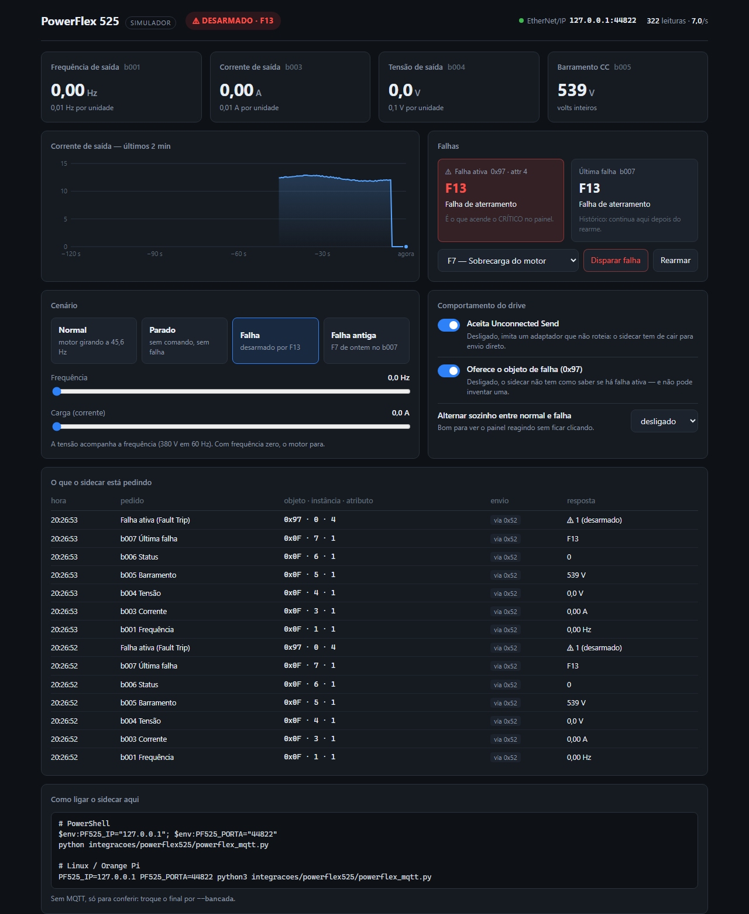
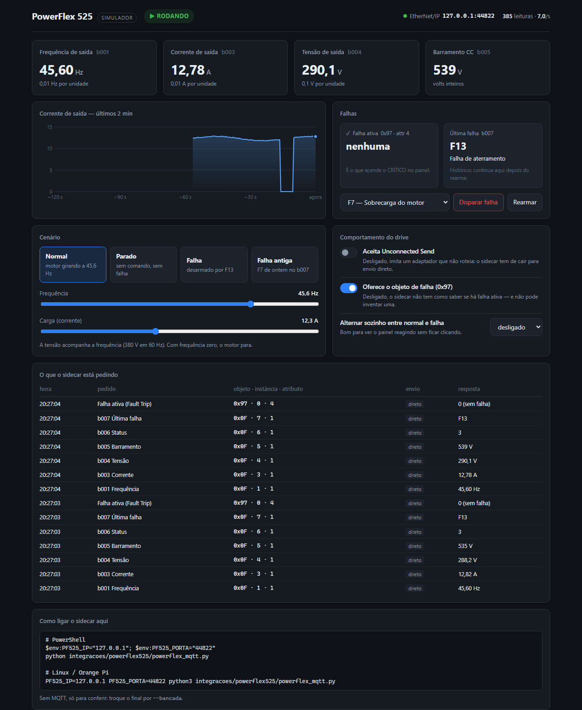
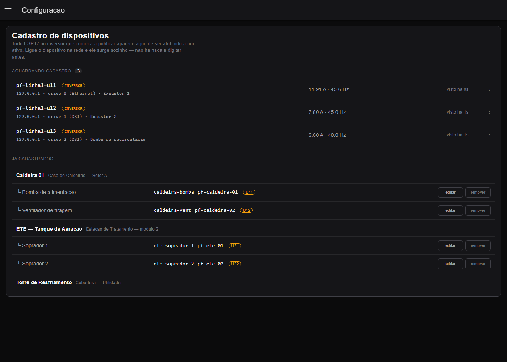

# Simuladores de inversor — manual

Dois drives **de mentira que falam o protocolo de verdade**. Servem para
exercitar os sidecars e o painel sem inversor nenhum na bancada:

```
drive simulado ──protocolo real──> sidecar ──MQTT──> painel
```

| Simulador | Imita | Protocolo | Interface |
|---|---|---|---|
| `drive_powerflex.py` | Allen-Bradley PowerFlex 525 | EtherNet/IP (CIP) | **painel no navegador** + linha de comando |
| `drive_danfoss.py` | Danfoss FC 51 / FC 301 / FC 302 | Modbus TCP | linha de comando |

Os dois **não precisam de biblioteca nenhuma**: é só Python 3.

> ⚠️ **O limite, que vale lembrar sempre.** Os simuladores foram escritos a
> partir da **mesma leitura dos manuais** que os sidecars. Eles provam que o
> sidecar faz o que o manual diz — não que o drive real se comporta como o
> manual diz. A bancada com o drive de verdade continua sendo o teste final
> (roteiros nos READMEs de `integracoes/`).

---

## PowerFlex 525

### Ligar

```bash
python tools/simuladores/drive_powerflex.py
```

```
PowerFlex 525 simulado em 0.0.0.0:44818  —  cenário 'normal'
  painel de controle:  http://localhost:8525/
```

Abra **http://localhost:8525/** no navegador. Pronto: o drive está
respondendo na porta 44818, a mesma de um PowerFlex real.

### Ligar o sidecar nele

Noutro terminal, da raiz do repositório:

```powershell
# Windows (PowerShell)
$env:PF525_IP="127.0.0.1"
python integracoes/powerflex525/powerflex_mqtt.py --bancada
```

```bash
# Linux / Orange Pi
PF525_IP=127.0.0.1 python3 integracoes/powerflex525/powerflex_mqtt.py --bancada
```

`--bancada` lê tudo uma vez e mostra na tela, sem precisar de broker. Tire
o `--bancada` para rodar como serviço, publicando em MQTT — aí o painel do
InsightX mostra o drive simulado como se fosse real.

> Se o simulador estiver noutra máquina (o Orange Pi lendo um simulador no
> seu PC, por exemplo), troque `127.0.0.1` pelo IP dessa máquina. O painel
> de controle mostra o comando pronto, com o endereço certo, no rodapé.

### O painel de controle



**Cabeçalho** — o estado do drive, sempre com ícone e texto: `▶ RODANDO`,
`■ PARADO` ou `⚠ DESARMADO · F13`. À direita, o endereço EtherNet/IP e
quantas leituras por segundo o sidecar está fazendo — se ficar em zero, o
sidecar não está conectado.

**Valores ao vivo** — os quatro parâmetros que o sidecar lê, com a escala de
cada um. Corrente e tensão oscilam como num motor de verdade.

**Gráfico** — a corrente dos últimos 2 minutos. Passe o mouse para ler o
valor de cada ponto.

**Falhas** — as duas caixas lado a lado são o ponto mais importante da tela:

| Caixa | De onde vem | O que significa |
|---|---|---|
| **Falha ativa** | objeto 0x97, atributo 4 | o drive está desarmado **agora**. É o que acende o CRÍTICO no painel |
| **Última falha** | parâmetro b007 | histórico. **Continua lá depois do rearme** |

Confundir as duas foi o bug mais grave da primeira versão do sidecar: uma
falha já resolvida deixava o ativo em alarme para sempre.



- **Disparar falha**: escolha o código na lista (os nomes vêm da mesma tabela
  do sidecar) e clique. O drive para, a corrente vai a zero, e a falha fica
  ativa e registrada no b007.
- **Rearmar**: limpa a falha ativa. O b007 **mantém** o código — repare na
  caixa da direita.

**Cenário** — estados prontos:

| Botão | O que monta |
|---|---|
| Normal | motor a 45,6 Hz, ~12 A, sem falha |
| Parado | sem comando, sem falha |
| Falha | desarmado por F13 (aterramento) |
| Falha antiga | motor rodando, **sem** falha ativa, mas com uma F7 de ontem no b007 — o caso que o sidecar antigo tratava errado |

**Frequência e carga** — mude o ponto de operação na hora. A tensão
acompanha a frequência (relação V/f: 380 V em 60 Hz); frequência zero para
o motor.

**Comportamento do drive** — para testar como o sidecar reage a drives que
se comportam diferente:

| Chave | Desligada, imita… | O que o sidecar deve fazer |
|---|---|---|
| Aceita Unconnected Send | um adaptador que não roteia e recusa o envelope 0x52 | cair para envio direto e seguir lendo |
| Oferece o objeto de falha | um drive sem o DPI Fault Object | seguir lendo, **sem inventar** falha |
| Alternar sozinho | — | a cada 15/30/60 s troca entre normal e falha: bom para ver o painel reagindo |



**O que o sidecar está pedindo** — cada leitura, na hora em que chega:
qual parâmetro, o endereço CIP (objeto · instância · atributo), se veio
dentro do envelope 0x52 ou direto, e o que o drive respondeu. É a forma
mais rápida de entender o protocolo — e de ver um problema de configuração:
um pedido ao atributo errado aparece em amarelo.

### Linha de comando

Tudo que o painel faz também dá para fixar na partida:

```bash
python tools/simuladores/drive_powerflex.py --cenario falha_antiga
python tools/simuladores/drive_powerflex.py --ciclo 30          # alterna sozinho
python tools/simuladores/drive_powerflex.py --recusa-ucmm       # recusa o envelope
python tools/simuladores/drive_powerflex.py --sem-objeto-falha
python tools/simuladores/drive_powerflex.py --porta 44819 --web 8526   # outras portas
python tools/simuladores/drive_powerflex.py --sem-web           # sem o painel
python tools/simuladores/drive_powerflex.py --encadeados 2      # nó Multi-Drive
```

### Nó Multi-Drive

`--encadeados N` (1 a 4) põe N drives atrás do simulado, como num painel
em que só o primeiro PowerFlex vai à rede e os outros se penduram nele pela
RS-485. Eles respondem nas faixas de instância do manual (drive 1 em
`17408 + n`, drive 2 em `18432 + n`…) e rodam em pontos diferentes (45, 40,
35 e 30 Hz), para dar para distinguir um do outro no painel. O registro de
pedidos mostra de qual drive é cada leitura.

Para ler o nó inteiro, o sidecar precisa da lista de inversores — veja a
seção *Vários inversores e Multi-Drive* em
[`integracoes/powerflex525/README.md`](../../integracoes/powerflex525/README.md).
É assim que eles chegam ao cadastro do painel, cada um com a sua origem:



A porta **44818** é a do EtherNet/IP. Se já houver algo nela (outro
simulador, um software da Rockwell), use outra e avise o sidecar com
`PF525_PORTA`.

---

## Danfoss FC 51 / FC 301 / FC 302

### Ligar

```bash
python tools/simuladores/drive_danfoss.py                  # FC 302, motor rodando
python tools/simuladores/drive_danfoss.py --familia fc51   # sem torque e rpm
```

### Ligar o sidecar nele

O simulador fala **Modbus TCP**; o sidecar precisa saber disso:

```powershell
# Windows (PowerShell)
$env:DANFOSS_TRANSPORTE="tcp"; $env:DANFOSS_IP="127.0.0.1"; $env:DANFOSS_PORTA="5020"
$env:DANFOSS_FAMILIA="fc302"
python integracoes/danfoss_vlt/danfoss_mqtt.py --bancada
```

```bash
# Linux / Orange Pi
DANFOSS_TRANSPORTE=tcp DANFOSS_IP=127.0.0.1 DANFOSS_PORTA=5020 DANFOSS_FAMILIA=fc302 \
  python3 integracoes/danfoss_vlt/danfoss_mqtt.py --bancada
```

> O FC 51 real da sua bancada fala **RTU**, pela RS-485. O protocolo acima
> do fio é o mesmo — o simulador usa TCP só porque não precisa de adaptador.

### Cenários

| `--cenario` | O que monta | Serve para ver |
|---|---|---|
| `normal` | 45,6 Hz, 12,34 A, 5,5 kW, 1480 rpm | a leitura básica |
| `frenando` | torque **−5,0 Nm**, potência **−1,2 kW** | números negativos saindo certos (a leitura antiga como 32 bits quebrava aqui) |
| `falha` | desarmado com **dois** alarmes: sobrecorrente (A13) e freio mecânico (A63) | vários alarmes ao mesmo tempo, e o bit 31 sem virar número negativo |
| `parado` | sem comando, sem alarme | — |

### Opções

```bash
python tools/simuladores/drive_danfoss.py --ciclo 30        # alterna normal <-> falha
python tools/simuladores/drive_danfoss.py --unidade 2       # endereço de escravo (par. 8-31)
python tools/simuladores/drive_danfoss.py --porta 5021
```

Com `--unidade 2` e o sidecar ainda em `DANFOSS_UNIT=1`, o simulador **não
responde** e o sidecar dá timeout — exatamente o sintoma de endereço de
escravo errado num drive real. Vale ver uma vez para reconhecer depois.

---

## Os testes usam estes mesmos simuladores

`tools/testes/testa_powerflex_cip.py` e `tools/testes/testa_danfoss_modbus.py`
importam as classes daqui. Existe **uma versão só** de cada drive simulado:
o que os testes garantem é o que você roda na mão.

```bash
pip install pycomm3 pymodbus          # os SIDECARS precisam; os simuladores não
python tools/testes/testa_powerflex_cip.py
python tools/testes/testa_danfoss_modbus.py
```

## De onde vem cada comportamento

| Comportamento | Fonte |
|---|---|
| PowerFlex: Parameter Object 0x0F, valor no atributo 1; DPI 0x93, atributo 9; DPI Fault Object 0x97 | [520COM-UM001](https://literature.rockwellautomation.com/idc/groups/literature/documents/um/520com-um001_-en-e.pdf), Apêndice C |
| PowerFlex: escalas b001–b005, b007 como histórico, códigos de falha | [520-UM001](https://literature.rockwellautomation.com/idc/groups/literature/documents/um/520-um001_-en-e.pdf), grupo *Basic Display* e *Drive Error Codes* |
| Danfoss: endereço (PNU × 10) − 1; 16 bits em 1 registrador, 32 em 2 | [FC 51 Design Guide](https://files.danfoss.com/download/Drives/MG02K402.pdf), §8.9.1 |
| Danfoss: tipo e escala de cada parâmetro; bits da palavra de alarme | [FC 301/302 Programming Guide](https://files.danfoss.com/download/Drives/DrivesM0013101.pdf), lista de parâmetros e tabela *Alarm Word* |

Os PDFs não estão no repositório — são dos fabricantes e somam ~50 MB. Os
links acima são os oficiais.
